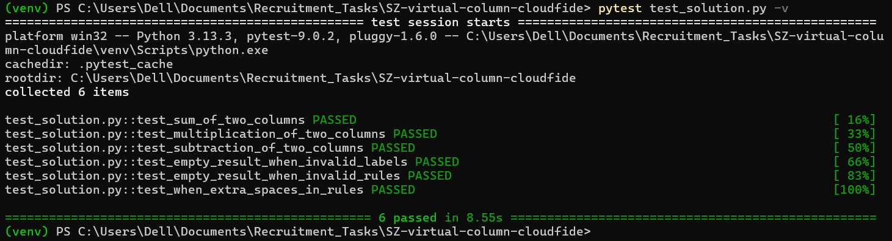

# Virtual Column – Pandas DataFrame
In response to your e-mail:) I am happy to provide my solution for the recruitment task.
Looking forward to hearing from you.

## Description

Implementation of the `add_virtual_column` function that adds a new virtual column 
to a pandas DataFrame based on a mathematical expression combining two existing columns.

Supported operations: `+`, `-`, `*`

## Usage
```python
import pandas as pd
from solution import add_virtual_column

fruits_sales = pd.DataFrame({
    'name': ['banana', 'apple'],
    'quantity': [10, 3],
    'price': [10, 1]
})

result = add_virtual_column(fruits_sales, "quantity * price", "total")
print(result)
```

Output:
```
     name  quantity  price  total
0  banana        10     10    100
1   apple         3      1      3
```

## Validation rules

- Column labels must contain only letters and underscores (`_`)
- Supported operators: `+`, `-`, `*`
- If `role` or any column label is invalid, returns empty DataFrame
- Columns used in `role` must exist in the DataFrame
- Extra spaces in `role` are handled correctly

## Project structure
```
SZ-virtual-column-cloudfide/
├── solution.py        # Main function implementation
├── test_solution.py   # Unit tests
├── requirements.txt   # Project dependencies
└── README.md
```

## How to run tests
```bash
# Create and activate virtual environment
python -m venv venv
venv\Scripts\activate       # Windows
source venv/bin/activate    # Mac/Linux

# Install dependencies
pip install -r requirements.txt

# Run tests
pytest test_solution.py -v
```

## Test Results

